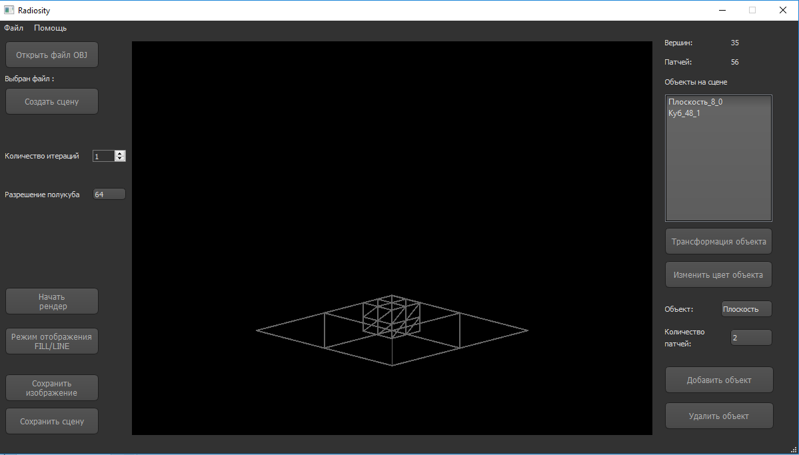
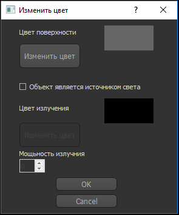
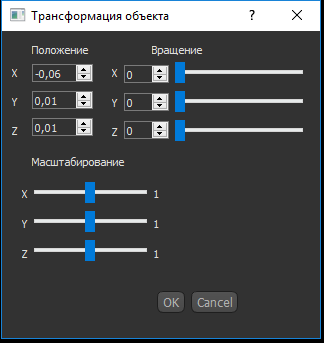
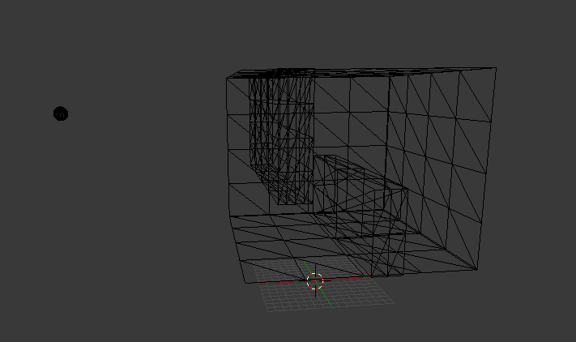
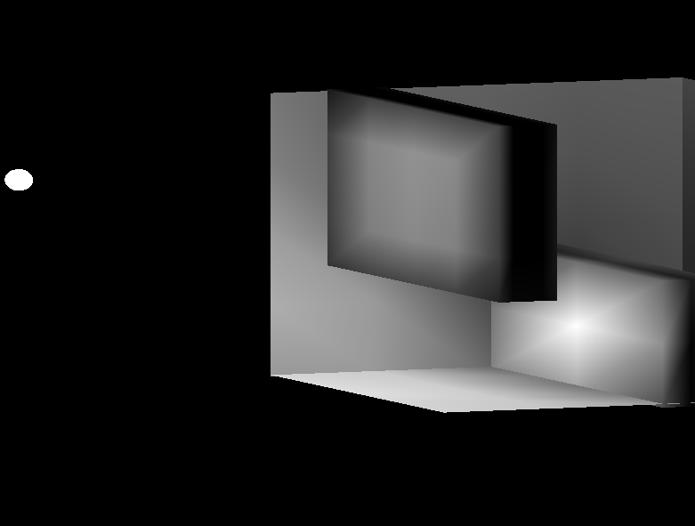
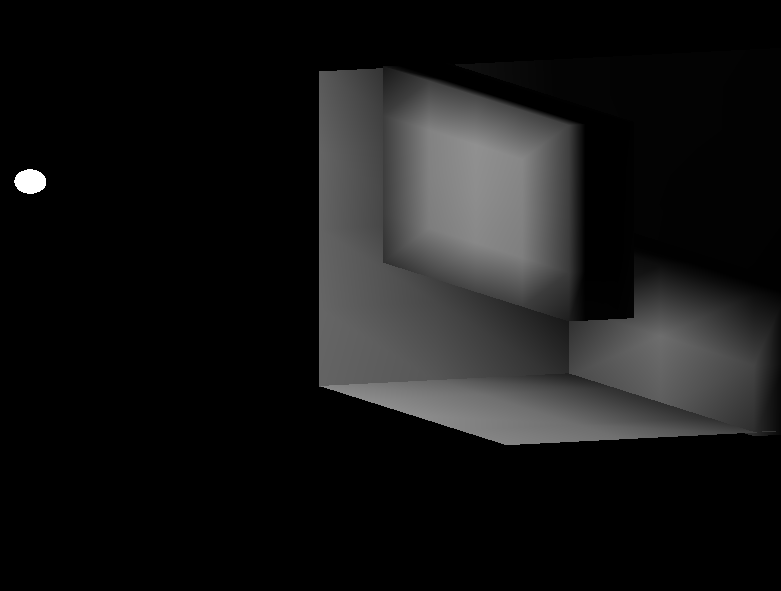

<h2>Application for building 3D scenes and lighting calculation on it by Radiosity method.</h2> 
 
With this program you can create or open the finished scene in the format obj. This application was developed using Qt Creator 4.3 and OpenGL 
 
You can also set the color and emissivity for each object in the scene. 
 
 
The number of iterations and the size of a semi-cub are responsible for the quality of the final image. 
 
Scene after 1 iteration 
 
Scene after 5 iteration 
